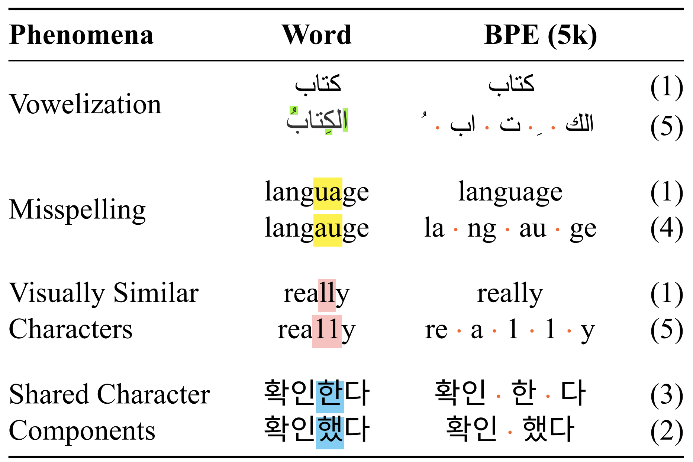

# Motivational Examples

Visually encoding text mimics how humans read, and creates equivalence
between what the human sees and how the computer processes the text.

Pre-tokenization into meaningful units (e.g. words) allows the model to encode information across languages
more equally, and reduces the impact of tokenization artifacts.

## Tokenization 

In his [lecture](https://www.youtube.com/watch?v=zduSFxRajkE), Andrej Karpathy discusses weird behaviors in models
that trace back to tokenization.

- Why can't LLM spell words? **Tokenization**.
- Why can't LLM do super simple string processing tasks like reversing a string? **Tokenization**.
- Why is LLM worse at non-English languages (e.g. Japanese)? **Tokenization**.
- Why is LLM bad at simple arithmetic? **Tokenization**.
- Why did GPT-2 have more than necessary trouble coding in Python? **Tokenization**.
- Why did my LLM abruptly halt when it sees the string "<endoftext>"? **Tokenization**.
- What is this weird warning I get about a "trailing whitespace"? **Tokenization**.
- Why the LLM break if I ask it about "SolidGoldMagikarp"? **Tokenization**.
- Why should I prefer to use YAML over JSON with LLMs? **Tokenization**.
- Why is LLM not actually end-to-end language modeling? **Tokenization**.
- What is the real root of suffering? **Tokenization**.

What if we encoded text as images of pre-tokenized words (alongside bytes)?

- ✅ LLMs should be able to spell words, they see the characters.
- ✅ LLMs should be able to do string processing tasks, they see the characters.
- ✅ LLMs should be equally good at all languages, with equitable pre-tokenization.
- ❌ Unclear if LLMs will be better at arithmetic, but they should be able to see the numbers.
- ❌ Unclear if LLMs will be better at coding.
- ✅ LLMs would not abruptly halt on special tokens, as the special tokens are different images.
- ✅ No more warnings about trailing whitespace, as whitespace is part of the token.
- ✅ LLMs should not break on weird words, as the tokenizer is not trained separately.
- ✅ JSON and YAML should be equally easy, as the quote-marks are part of the token.
- ☑️ LLMs should be more end-to-end language modeling *except for pre-tokenization*.
- ❓ The real root of suffering is still unclear.

## Robust Open Vocabulary Translation

[Salesky et al. (2021)](https://arxiv.org/pdf/2104.08211) claim that:

> Machine translation models have discrete vocabularies and commonly use subword segmentation techniques 
> to achieve an ‘open vocabulary.’ This approach relies on consistent and correct underlying unicode sequences,
> and makes models susceptible to degradation from common types of noise and variation.

### Diacritics

For latin scripts, such as German, we may use diacritics such as Umlauts (e.g. `ä`, `ö`, `ü`).
We can write them down either as a single character (e.g. Unicode Normalization Form C `ü` = [2448]), 
or as a combination of two characters (e.g. Unicode Normalization Form D `u` + `¨` = [84, 136, 230]).

The paper gives the example of Arabic `كتاب` (with 3 tokens in GPT-4)  which fully vowelized is `كِتَابٌ` (7 tokens).
Another would be Hebrew `ספר` (with 5 tokens in GPT-4) which diacritized is `סֵפֶר` (9 tokens).

### Misspelling

The paper gives an example of the words `language` and `langauge` which are tokenized as 1 and 2 tokens 
respectively in GPT-4, giving a very different representation to what is likely intended as the same meaning.
The problems may only increase in non-latin scripts.

### Visually Similar / Identical Characters

People often obfuscate text using visually similar or identical characters,
with homograph attacks --- using characters that look the same from different scripts,
to LeetSpeak --- using characters that look similar.

For example, the Latin character `a` (U+0061) looks very similar to the Cyrillic character `а` (U+0430).
Given the word `man` (1 token in GPT-4), if we replace the `a` with the Cyrillic `а`, we get `mаn` (3 tokens).

The paper gives the LeetSpeak example for `really` vs `rea11y` (1 token vs 3 tokens in GPT-4).

## Tokenization Parity

[Foroutan and Meister et al. (2025)](https://www.arxiv.org/pdf/2508.04796) note that:
> In multilingual models, the same meaning can take far more tokens in some languages, 
> penalizing users of underrepresented languages with worse performance and higher API costs.

Let's consider the same example, for whitespace pre-tokenization parity:

| Language | Text (Google Translate) | Bytes (UTF-8) | Tokens (GPT-4) | Words (Whitespace) |
|----------|-------------------------|-------------|----------------|--------------------|
| English | Tours are cheaper for larger groups, so if you're by yourself or with just one friend, try to meet other people and form a group of four to six for a better per-person rate. | 173 | 40 | 34 |
| Italian | I tour sono più economici per i gruppi più numerosi, quindi se sei da solo o con un solo amico, prova a incontrare altre persone e a formare un gruppo da quattro a sei persone per ottenere una tariffa più conveniente a persona. | 230 | 58 | 43 |
| German | Touren sind für größere Gruppen günstiger. Wenn Sie also alleine oder mit nur einem Freund unterwegs sind, versuchen Sie, andere Leute kennenzulernen und eine Gruppe von vier bis sechs Personen zu bilden, um einen besseren Preis pro Person zu erhalten. | 256 | 64 | 40 |
| Finnish | Retket ovat halvempia suuremmille ryhmille, joten jos olet yksin tai vain yhden ystävän kanssa, yritä tavata muita ihmisiä ja muodosta neljän tai kuuden hengen ryhmä saadaksesi paremman hinnan per henkilö. | 212 | 79 | 30 |
| Arabic | تكون الجولات أرخص بالنسبة للمجموعات الكبيرة، لذلك إذا كنت بمفردك أو مع صديق واحد فقط، فحاول مقابلة أشخاص آخرين وتشكيل مجموعة مكونة من أربعة إلى ستة أشخاص للحصول على سعر أفضل للشخص الواحد. | 341 | 140 | 33 |
| Hebrew | סיורים זולים יותר לקבוצות גדולות יותר, כך שאם אתם לבד או עם חבר אחד בלבד, נסו לפגוש אנשים אחרים וליצור קבוצה של ארבעה עד שישה אנשים לקבלת מחיר טוב יותר לאדם. | 281 | 151 | 31 |
| Shan | ၶၢဝ်းတၢင်း တႃႇၸုမ်းယႂ်ႇၼၼ်ႉ ၵႃႈၶၼ်မၼ်း ထုၵ်ႇလိူဝ်လႄႈ သင်ဝႃႈ ၸဝ်ႈၵဝ်ႇ ယူႇႁင်းၵူၺ်း ဢမ်ႇၼၼ် မီးဢူၺ်းၵေႃႉ ၵေႃႉလဵဝ်ၵွႆးၼႆၸိုင် ၶတ်းၸႂ် ႁူပ်ႉထူပ်း ၵူၼ်းတၢင်ႇၵေႃႉသေ ႁဵတ်းၸုမ်း 4 ၵေႃႉ တေႃႇထိုင် 6 ၵေႃႉ ႁႂ်ႈလႆႈ ၵႃႈၶၼ် ၼိုင်ႈၵေႃႉ ဢၼ်လီလိူဝ်ၼၼ်ႉယဝ်ႉ။ | 669 | 531 | 23 |

#### Bytes Efficiency

English really is the most efficient language in terms of bytes count, which is not suprising given its Latin alphabet,
without diacritics or ligatures (with 1 byte per character).
Other languages that use the Latin alphabet are also relatively efficient (e.g. Italian, German, Finnish), but their 
use of diacritics and ligatures increases the byte count.

Languages that use non-Latin scripts (e.g. Arabic, Hebrew, Shan) have a much higher byte count, due to the need for
multiple bytes per character in UTF-8 encoding. Hebrew and Arabic use two bytes per character, 
while Shan uses three bytes per character, not counting ligatures.

#### Tokenization Efficiency (GPT-4)

English is also the most efficient language in terms of token count, which is not suprising given that the tokenizer
was trained primarily on English text.
Other languages that use the Latin alphabet are also relatively efficient, but the moment we move to non-Latin scripts,
the token count increases significantly (up to 13x for Shan).

#### Words Efficiency

Assuming whitespace tokenization as a proxy for words, we see that English is not the most efficient language.
This makes sense, from a language efficiency perspective, that there is no computational bias towards English.
Languages distribute between 23 and 43 words for the same sentence, with English right in the middle with 34.
